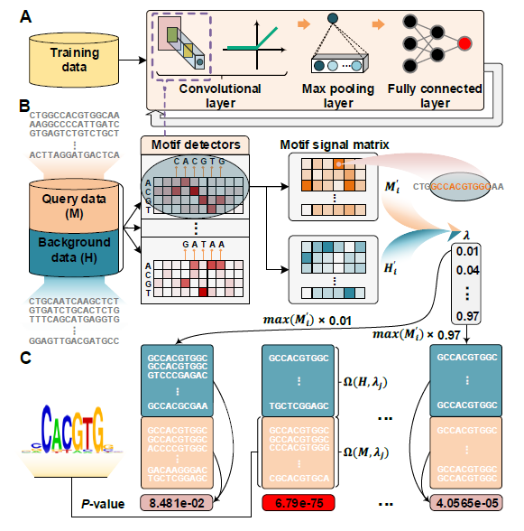
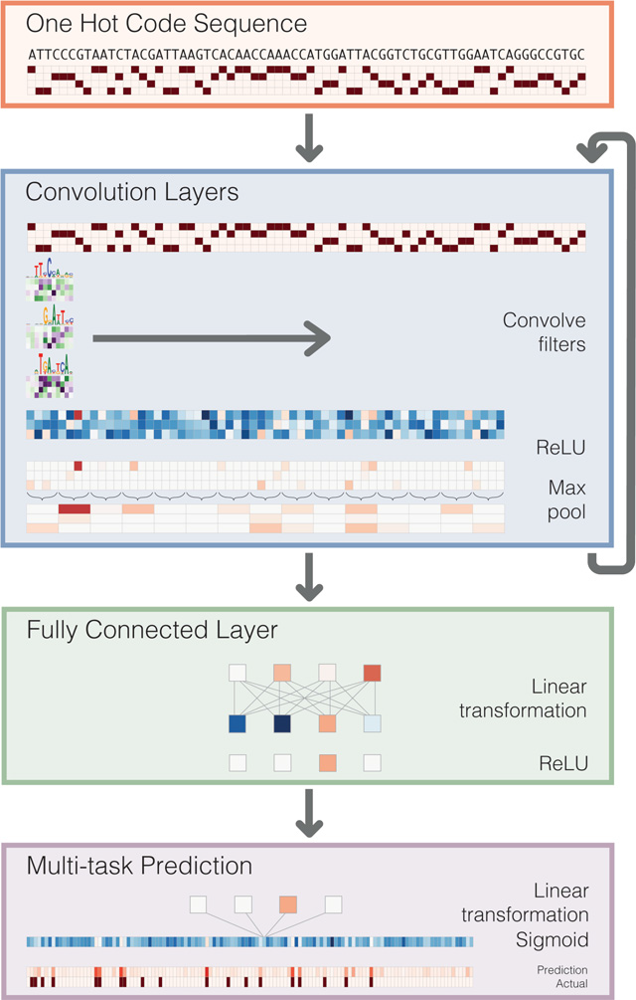

[[toc]]

# FAQ

## Something broke! what do I do?

The server is in active maintenance so it is possible that something can break during our updates. If it is not connected, please try refreshing your browser, and contact us to report your problems.
If that does not fix the problem, please send us your input file and how you reproduced the bug to help us fix the problem by using the Report bug button. When reporting a bug, please also include screenshots and the browser that you used.

## I have a great feature idea.How do i suggest it to you.

We are always looking for ways to improve the server! Please use our contact email on the about page to send us feature suggestions.

## which brower is proposed.

The google, firfox and safari.

## Why we deploy the Basset model on this server.

Before developing this server, we applied the main top deep learning model to find motif on the 185 chip-seq datasets. In our experiments, we evaluate the performance of all deep learning models from two aspects including find motifs and peaks classification. About the first aspect we compare all deep learning models' performance by computing the P-value, E-value, and Q-value of motifs. with regarding to the second one, we select eight criterions to evaluate the capacities that identify the peaks is TFs binding site or not, finally we summary eight criterions as the area of octagon.  
Accoding to the area of each deep learning model shown as figure1, the Basset model obtainded the best performance about peaks classification and the DESSO model obtainded the best performance about finding motifs.
  
Figure 1. A characterization of the 20 methods evaluated in this study and their overall evaluation results

## How many moitf databases are compared on this server.

we compared the found motif to the hocomoco, transfac and jaspar databases.

## How to analysis the single-cell ship-seq data.

we select 6 of 10 samples with peak length of 50k from the GSE117309 as total single-cell dataset,and find motifs from these data. we analysis the found motif, which is depicted in single-cell topic[single-cell](link to single-cell topic).

## What can this server do in motif analyses.

> **Our server has a number of novel capabilities:**  
> (i) find TFs are related to cancer types  
> (ii) identifying the binding sites  
> (iii) finding DNA motifs from chip-seq peaks  
> (iv) match denovo motifs to the existed motifs  
> (v) motif scanning  
> (vi) annotation genes to TFs binding sites
> (vii) finding motifs from the single-cell schip-seq dataset

## Which model is used on this server?

### method A

Now, there is novel deep learning model named DEESO (Yang, 2019), which has some specificities about motif prediction. The DESSO model is the first tool to use the structure shape of DNA to find motifs, and obtain the best performance compared to the existed deep learning tools,such as Deepbind, Basset, etc.

Figure 1. Schematic overview of DESSO framework.
A.The CNN model for optimizing motif detectors; B.Determination of optimal motif instances recognized by each motif detector; C. Construction of the optimized motif profile. This algorithm of DESSO is depicted in detail, please see the section algorithm.

### method B

The Basset model can be also used to find motifs from the genomics data, and we have located the Basset model for each transcription factor.we have selected 185 cancers related transcription factors, and compared to the existed 19 deep learning models about peaks classification. Finally, our experimental results show that the Basset model obtained the highest score for peaks prediction.

## How many datasets are utilized on the website?

The this server, we used the dataset including two parts. The first part is
the 690 ChIP-Seq datasets of uniform TFBS based on ENCODE data freeze were downloaded from the ENCODE Analysis Database at UCSC. These datasets contained 161 TFs and cover 91 human cell types,each dataset contained a number of peaks ranging from 101 to 92385, ranked in the decreasing order of their signal scores. These peaks were derived from the SPP peak caller and de-noised by the Irreproducible Discovery Rate based on signal reproducibility among biological replicates. The average length of the de-noised peaks is 300 bps. In our study, we processed the peaks as the fixed length of 101, based on the TFs binding preference.
the second is that We collect obtain chip-seq data of 185 TFs associated with 20 cancer types from the pumed, we obtain the dinding sites of these TFs from the CIStrime website [Zheng, 2018], which must meet that quality control is the highest and belong to human. we train the deep learning models through these two part of datasets,and publish our results on the website.

## What kinds of formats of motifs can be used to analysis.

Currently we accept three kinds of motif formats, shown as follows,  
(i)bed file

(ii) meme

(iii) fasta

(vi) pwm
